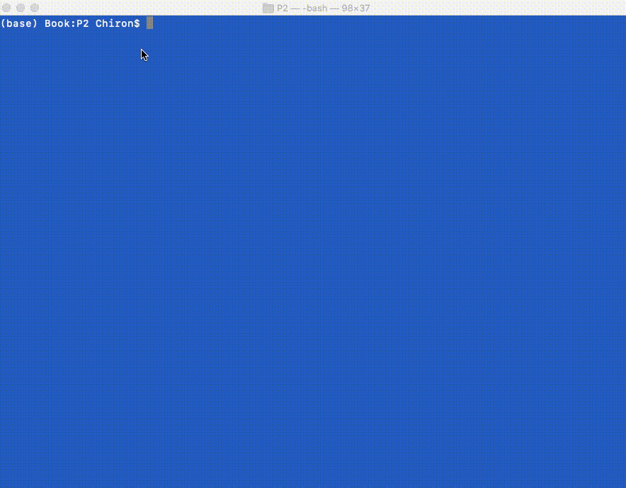
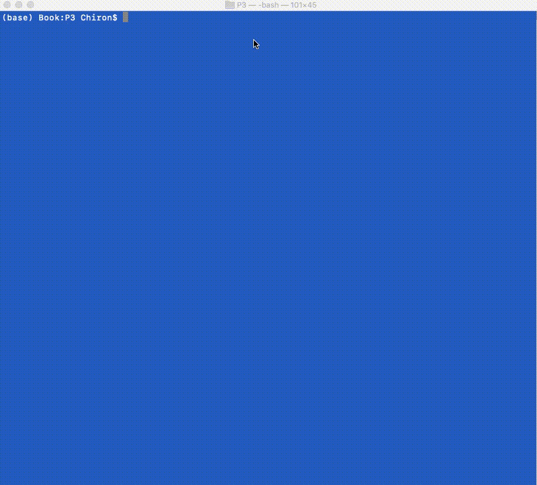
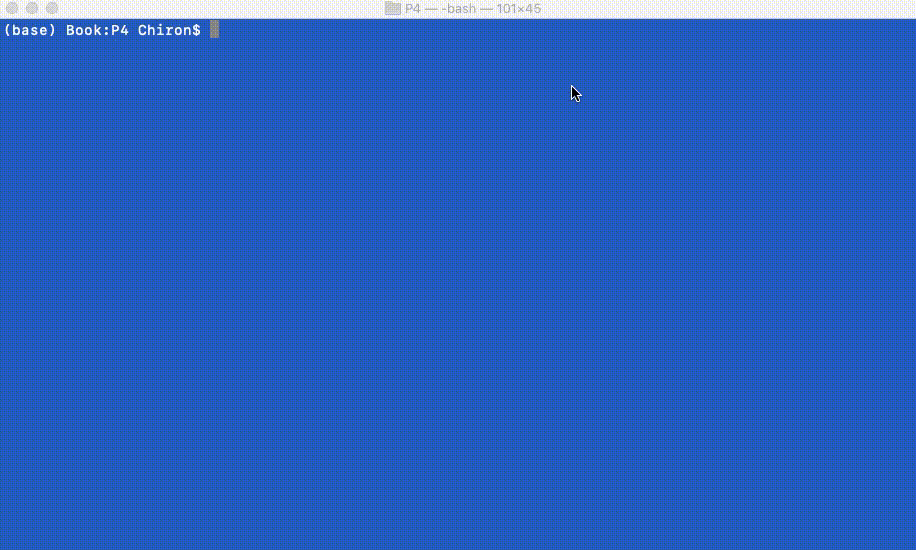
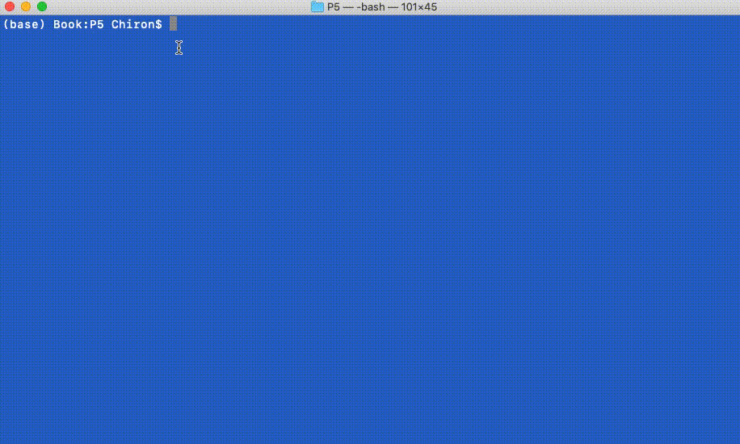

# CS370 - Operating Systems

## Assignment 1

- Create and compile multiple C files
- Dynamically allocate memory for an array filled with random numbers based on a seed
- Get median and running count from array
- Clear dynamically allocated memory with no memory leaks
  ./Driver.out <seed>

## Assignment 2

- Work with Fork and Exec to create new processes one the fly
- Take arguments from input and pass to child process
- Check if dividend is divisible by divisor
- Wait on child process to finish and check exit code
  ./coordinator <divisor> <dividend> <dividend> <dividend> <dividend>

## Assignment 3

- Similar to Assignment 2 but data will be passed using shared memory
- Create shared memory for each of the child processes
- Fork into child processes and have them attach to the newly created shared memory
- Child process does the calculation, writes to shared memory then detaches and returns
- Parent process waits for child and reads from shared memory, then cleans up the shared memory

## Assignment 4

- Implementation of the Producer Consumer problem in Java
- Create a buffer of size 100 that Producer will pass content into and Consumer will read from
- Producer and Consumer will be in threads that will execute at the same time
- Use locks and other thread safe procedures to avoid race conditions
- At the end the total produced should equal the total consumed

## Assignment 5

- Implement 3 different compiler scheduling algorithms (FCFS, SJFP, Priority)
- Input will be a text file with PID, arrival Time, burst Duration, importance
- Based on the algorithm tasks must be queued in a different order
- Store average turn around time, average waiting time, and throughput for each algorithm

